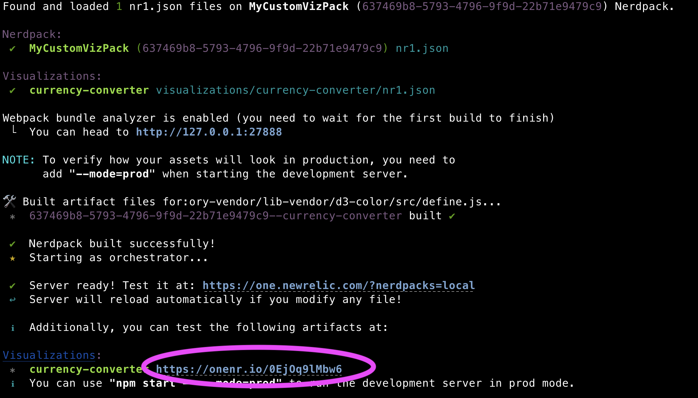
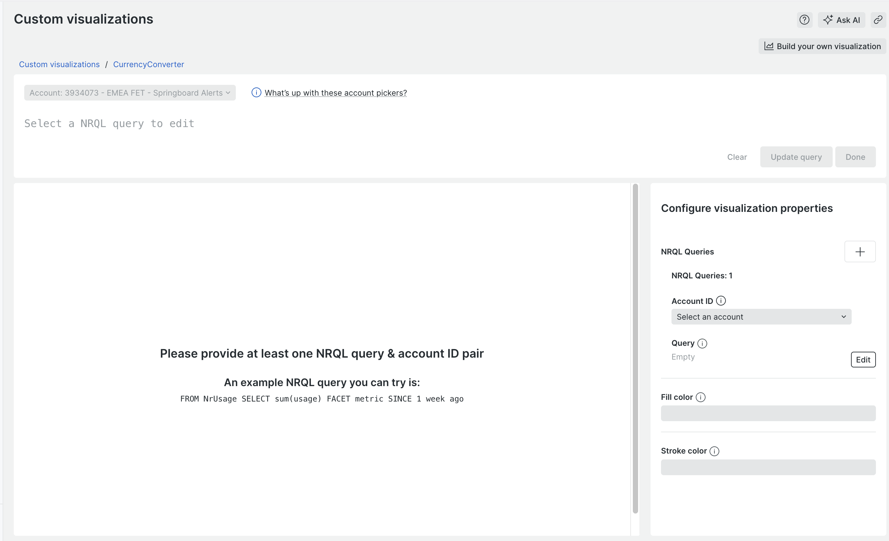
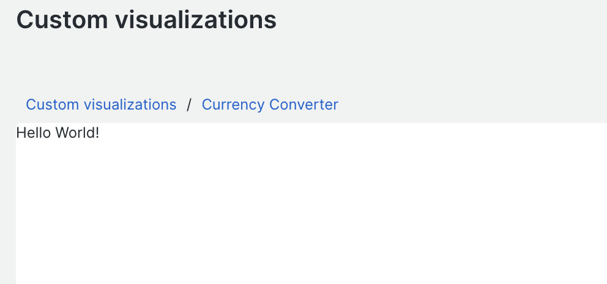
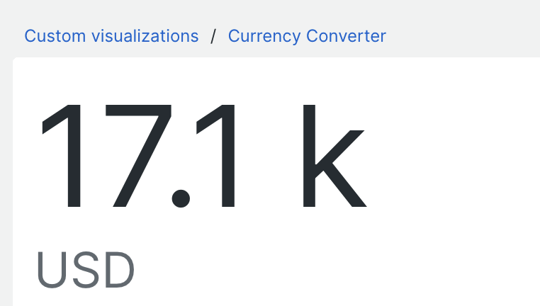
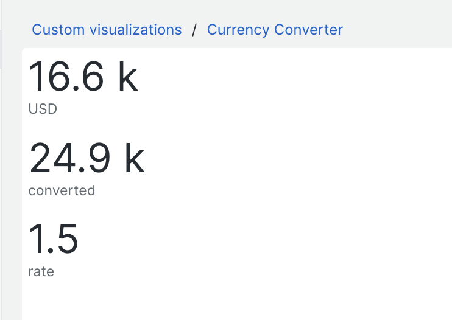
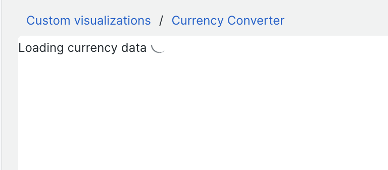
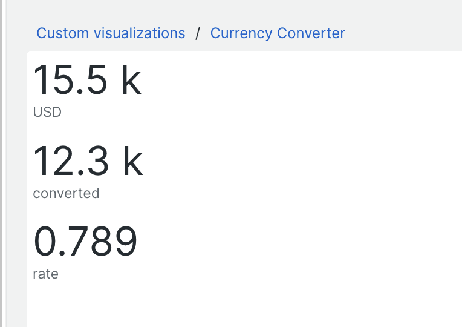
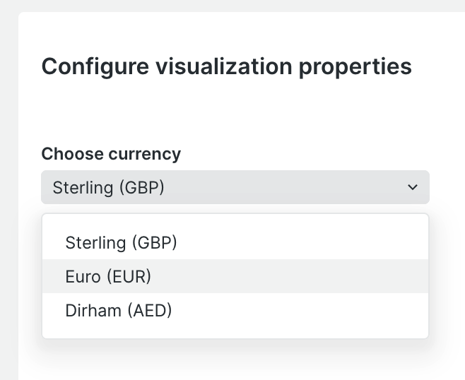
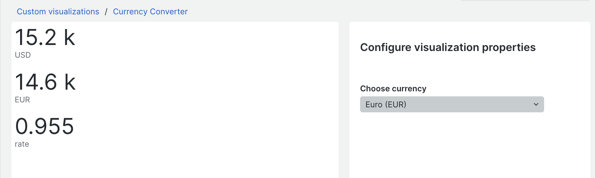

# New Relic Custom Vizualisation Hands On Lab
This lab guides you through creating and deploying a custom visualisation from scratch. When it comes to visualisation theres a huge oportunity for what you may build, you're only limited by your imagination!

For this lab you will create a very simple custom visualisation from scratch. You will learn how to create the viz, how to use the SDK to render data, how to configure it through options and how to deploy it to your account.

### The Currency Viz
The custom viz you will build is very simple:  It will use real-time currency exchange rate data from an external API to convert some telemetry data into the users chosen currency and display on the dashboard. Custom visualisations are often used to help surface business data, and currency conversions, price lookups etc are a good example of an enrichment you might want to build to better serve your business observability needs.

### Pre-requsites

You will need:

- A New Relic account (with Admin / Nerdpack manager rights to deploy)
- [Nodejs](https://nodejs.org/en/download/package-manager) installed locally
- An openexchangerates.org appID (see below)
- Suitable terminal and code editor

This example uses data from https://openexchangerates.org 
Sign up for a free account and grab yourself an appId. Once you have one check that when you visit this link you get some exchaange rate data:

[https://openexchangerates.org/api/latest.json?app_id=YOUR-APP-ID-HERE](https://openexchangerates.org/api/latest.json?app_id=YOUR-APP-ID-HERE)


# Lab

## Part 1 - "Lights on the board"
In this part we install all the necessary bits and pieces and make sure things are working correctly.

#### Step 1:

In New Relic navigate to Apps in the main menu, click on "Custom visualizations" and then "Build your own visualization" to view the quick start page.

#### Step 2:

Follow the guide **steps 1 to 3 ONLY** to download and install the NR1 CLI tool, generate an API key and add it to your profile.

#### Step 3:

At this point you should be able to run `nr1 profiles:whoami` and get a sensible output!

#### Step 4:

You now need to use the NR1 tool to create a custom visualisation project. Run the following:

```
nr1 create
```

Choose "Visualization" from the list of options. It will ask you to first provide a name for the nerdpack (which is the overall package containing your viz). Use `my-custom-viz-pack`. It will then ask for the name of your custom visualization, use: `currency-converter`

#### Step 5: 

You should see the tool create a folder called `my-custom-viz-pack`. Switch to this folder and serve the visualisation using nr1 as follows:

```
cd my-custom-viz-pack
nr1 nerdpack:serve
```

The tool will build the project, and at the end provide a link to your custom visualization. Open this link in your web browser.



You should see the custom visualization load up and look a bit like the following. If so then well done, you got lights on the board! 

> If its not working you need to troubleshoot to get this working before continuing with the rest of the lab.




## Part 2 - Resetting the boilerplate
The nr1 create command built an example visualisation with some boilerplate code. You will tidy this up before getting creative.

#### Step 1:

Review the folder structure. You will see that there is a folder called `vizualisations` - its in here that your visualization lives in a sub folder called `currency-converter`. You can add many custom visualizations into this package, each in a seperate folder here.

Within the `currency-converter` folder are three files:

- index.js - this is where your code goes
- styles.scss - this is where you can add css styling
- nr1.json - this is where you configure the visualization.


#### Step 2:

Lets start with cleaning up the `nr1.json` file. Make sure you are editing the one in the `visualizations/currency-converter` folder.

- Change the `displayName` to "Currency Converter"
- Delete everything in the `configuration` array, it should simply read: 
```"configuration": []```


#### Step 3:

Now edit the `index.js` file and delete everything. Yes really! Delete it all.

#### Step 4:

Add the following code to `index.js`:

```
const Viz = () => {
	return  <div>Hello World!</div>
}

export default Viz;

```

#### Step 4:

If its still running stop the nr1 server (CTRL+C) then restart it:

```
nr1 nerdpack:serve
```

> Some changes, like those in `nr1.json` require you to restart the local server. But most changes you make should hot reload!

#### Step 5:

Reload your browser, you should see "Hello World" and the config options should all have gone, like this:



## Part 3 - Adding a Billboard component

The New Relic SDK comes with a number of ready built components we can use in our custom visualizations. In this case we will use the `<BillboardChart />` component.

#### Step 1:

All the SDK components are documented. Review the documentation for the BillboardChart component to understand a little of how it works: [`<BillboardChart />` Docs](https://docs.newrelic.com/docs/new-relic-solutions/build-nr-ui/sdk-component/charts/BillboardChart/)

#### Step 2:

We need to import the component from the nr1 library. The nr1 tool bundles this already, so add to the very top of `index.js` the following:

```
import { BillboardChart } from 'nr1';
```

#### Step 3:

Update the return statement to return the BillboardChart instead of our hello world message. You need to supply your account ID and a query that returns some data. It doesnt matter what that data is right now, in this case we use the `Public_APICall` event type available in all US accounts to give us a number that acts as our source value in US dollars. (You can replace this with any query you like that returns asingle row value)

```
const Viz = () => {
	return  <BillboardChart
    	accountId={YOUR-ACCOUNT-ID-HERE}
    	query={`select count(*)/1000 as 'USD' from Public_APICall since 10 minutes ago`}
	/>
}
```

#### Step 4:

Review the changes in the browser, you should now see a billboard chart showing a value of some kind:



[Full index.js code from Part 3](./solutions/part3.js)

## Part 4 - Setting and using the 'rate'

We have our source value in USD and we want to convert that by multiplying by an exchange rate. Lets start off by hard coding that rate for now.

#### Step 1:

We will use React's [useState hook](https://react.dev/reference/react/useState) to manage our rate value. Add another import statement to the top of the file, just after the existing one to import the useState hook:

```
import { useState } from "react";
```

#### Step 2:

Add the following code before the BillboardChart to setup `rate` as a state variable, setting the default value to `1.5`

```
const Viz = () => {
	const [rate, setRate] = useState(1.5);

	return  <BillboardChart...
}
```

#### Step 3:

Update the `query` in the BillboardChart to use this `rate` variable to calculate the converted rate:

```
query={`select count(*)/1000 as 'USD', (count(*)/1000) * ${rate} as 'converted', ${rate} as 'rate'  from Public_APICall since 10 minutes ago`}
```

#### Step 4:

View the changes in the browser, you should see the USD value and another value 1.5 larger. Try changing the rate in the code to see it change.



[Full index.js code from Part 4](./solutions/part4.js)


## Part 5 - Loading spinner

We need to load the exchange rate data, which may take some time, so whilst its loading it would be good to show a [loading spinner](!https://docs.newrelic.com/docs/new-relic-solutions/build-nr-ui/sdk-component/feedback/Spinner/) to the user. 

#### Step 1:

Update the import statement to import the Spinner component from the nr1 library:

```
import { BillboardChart, Spinner } from 'nr1'; 
```


#### Step 2:

Change the default rate to `null` instead of `1.5` and immediately after add the following spinner code, before the BillboardChart:

```
const Viz = () => {
    const [rate, setRate] = useState(null);
    if (!rate) {
            return <div>Loading currency data <Spinner inline /></div>
    }

    return  <BillboardChart ...
    ...
    />
```

> This tests if `rate` is set, if not it returns the Spinner and the BillboardChart is never shown.


#### Step 3:

View the changes in the browser, you should see a spinner spining indefinitely!



[Full index.js code from Part 5](./solutions/part5.js)

## Part 6 - Loading the currency data from API

You need to load the data from the API and use it to set the `rate`. We'll do this using [axios](https://axios-http.com/docs/intro) an http request library. 

> We dont actually need axios, we could do it natively in nodejs but this is a good excuse to see how we can use npm modules!

#### Step 1:

Stop the server (CTRL+C) and install axios then restart the server:

```
npm install -s axios
nr1 nerdpack:serve
```

#### Step 2:

Add another import statement to the top of the file, just under the others:

```
import axios from 'axios'
```


#### Step 3: 

In order to react to changes and to load the data we need to use Reacts [useEffect hook](https://react.dev/reference/react/useEffect). Update the existing import from React to include useEffect:

```
import { useState, useEffect } from "react";
```

#### Step 4:

We need another state variable to hold the loaded currencies, add another useState after the `rate` one called `currencies`:
```
...
const Viz = () => {
    const [rate, setRate] = useState(null);
    const [currencies, setCurrencies] = useState(null);
...
```

#### Step 5:

Next, just after the currencies hook add a useEffect hook to load the API data, replacing the AppId with your own:

```
const Viz = () => {
    const [rate, setRate] = useState(null);
    const [currencies, setCurrencies] = useState(null);

    //run once on first load to gather currencies
    useEffect( async () => {
        const response = await axios.get('https://openexchangerates.org/api/latest.json?app_id=YOUR-APP-ID');
        setCurrencies(response.data.rates);
    }, []);

...
```

> This 'effect' will run once when the viz loads. It gathers the data from the API and sets the result in the `currencies` state variable. You could of course load this data more frequently if you needed to, but once is enough for this lab.


#### Step 6:

Add another useEffect hook to set the rate once the currencies are loaded. Add it just after the previous. In this case we hard code the chosen currency to "GBP".

```
    //Set the rate using loaded currencies
    useEffect( async () => {
        if(currencies) {
            setRate(currencies["GBP"]);
        }
    }, [currencies])
```

> This effect is run whenever the `currencies` value changes.


#### Step 7:

View the changes in the browser, you should see the exchange rates updated with the live GBP rate being used for conversion.

> Not working? Ensure you set your AppId correctly and that you get JSON data back successfully from the API https://openexchangerates.org/api/latest.json?app_id=YOUR-APP-ID



[Full index.js code from Part 6](./solutions/part6.js)

## Part 7 - Adding configuration options

Currently our viz is hard coded to convert to GBP. We can make this a visualization configuration option so that the user can choose the currency when they add the viz to a dashboard.

#### Step 1:

Custom visualization [configuration options](https://docs.newrelic.com/docs/new-relic-solutions/build-nr-ui/custom-visualizations/configuration-options/) are configured in `nr1.json` which manages the metadata for the viz. We provide a schema that defines what configuration options should appear.


In this case we would like to add a drop down of currencies for the user to choose from. Edit the `nr1.json` file and update the `configuration` block as follows:

```
{
    "schemaType": "VISUALIZATION",
    "id": "currency-converter",
    "displayName": "Currency Converter",
    "description": "",


    "configuration": [
    	{
        	"name": "currency",
        	"title": "Choose currency",
        	"type": "enum",
        	"items": [
             	{
                	"title": "Sterling (GBP)",
                	"value": "GBP"
            	},{
                	"title": "Euro (EUR)",
                	"value": "EUR"
            	},{
                	"title": "Dirham (AED)",
                	"value": "AED"
            	}
        	]
    	}
	]

}

```

> This defines that we want to offer a drop down containing the three currencies specified, that we want the option labeled "Choose currency" and we want the chosen value to be returned in a prop called `currency`. There are many other types of configuration option available such as text box, number, query, check box etc.

#### Step 2:

Stop the server (CTRL+C) and restart it:

```
nr1 nerdpack:serve
```

#### Step 3:

Reload the custom viz browser window, you should now see the choose currency drop down in the options panel on the right.



[Full nr1.json code from Part 7](./solutions/part7-nr1.json)

## Part 8 - Wiring up the configuration

You've specified what configuration you want but we now need to wire that up to the viz. 


#### Step 1:

Configuration options are passed to our function as an object. Extract the prop `currency` from the first function call parameter and then create a variable `chosenCurrency` that uses this but sets the default to GBP:

```
        Extract currency from props here
                |
                V
const Viz = ({currency}) => {
	const chosenCurrency = currency ?? 'GBP';

```


#### Step 2:

Amend the second `useEffect` block so that it uses the chosen currency in the `setRate()` function call.  

Also add `chosenCurrency` to the trigger array at the end. (This means when we change the value of `chosenCurrency` the effect will run and the rate will be updated.)

```
//Set the rate using loaded currencies
useEffect( async () => {
	if(currencies) {
    	setRate(currencies[chosenCurrency]);
	}
}, [currencies,chosenCurrency]);
```

#### Step 3:

Update the `query` in the BillboardCharts so that the `chosenCurrency` is displayed as the label of the converted value:

```
query={`select count(*)/1000 as 'USD', (count(*)/1000) * ${rate} as '${chosenCurrency}', ${rate} as 'rate'  from Public_APICall since 10 minutes ago`}
```

#### Step 4:

Review the changes in the browser. You should be able to change the currency in the options and see the changes reflecting in the visualization.



[Full index.js code from Part 8](./solutions/part8.js)


## Part 9 - Fixing the query bug

You may notice if you change the currency quite quickly the rate doesnt always update straight away. Generally this wouldnt be a problem as the options are only changeable when editing the viz. However its good to understand why this is happening and how to fix it.

#### Step 1:

If you look carefully at the query you'll see it contains two variables `rate` and `chosenCurrency`. Because these values are set independently and asynchronously they don't necessarily change at the exact same time, so there is a brief moment when one has been changed and the other hasn't.

```
select count(*)/1000 as 'USD', (count(*)/1000) * ${rate} as '${chosenCurrency}', ${rate} as 'rate'  from Public_APICall since 10 minutes ago
```

#### Step 2:

To fix this we can set the query using an effect. We only need to change the query when `rate` changes. Add another useState hook near the top of the function to manage a `query` state variable:

```
const [query, setQuery] = useState(null);
```


#### Step 3:

Add a new useEffect block after the previous ones that triggers the `setQuery` when `rate` changes:

```
    //Set query when rate changes
    useEffect( async () => {
        setQuery(`select count(*)/1000 as 'USD', (count(*)/1000) * ${rate} as '${chosenCurrency}', ${rate} as 'rate'  from Public_APICall since 10 minutes ago`)
    }, [rate]);
```


#### Step 4:

Update the BillboardChart `query` prop to use this state variable:

```
	return  <BillboardChart
    	accountId={YOUR-ACCOUNT-ID-HERE}
    	query={query}
	/>
```


#### Step 5:

Observe the changes in the browser. You should find the chosen rate is always properly applied now.

> Its a common issue with React components to need to think carefully about what changes to props will cause re-rendering. By using an effect we reduce the number of times the `query` changes, which in turn reduces the actual number of backend queries made by the component.

[Full index.js code from Part 9](./solutions/part9.js)

## Part 10 - Deploying the visualization and adding to a dashbaord

The visualization is (almost!) complete, lets deploy it and add to a dashbaord.

#### Step 1: 

Before we deploy lets make a small cosmetic change. Currently the viz is very small, lets make it fit all the avaliable space, then when its on a dashboard we can adjust its size.

Update the `BillboardChart` component by adding the `fullWidth` and `fullHeight` properties:

```
return <BillboardChart 
    fullWidth
    fullHeight
    accountId={YOUR-ACCOUNT-ID-HERE}
    query={query}
/>
```


#### Step 2:

To add the viz to you account we need to build and publish it, then subscribe your account to it to make it visible:

```
nr1 nerdpack:publish
nr1 subscription:set
```

#### Step 3:

- Navigate to the Apps in the main navigation.
- Look at your URL in the browser URL bar and remove `nerdpacks=local` if its present. (This is what points it to your local machine when testing)
- Goto Custom Visualizations and look for your viz "Currency Converter"
- Click Enable if asked
- Choose a currency and add to a dashboard
- Observe that the widget got added to the dashboard. You can edit the dashboard and resize it if you like

#### Step 4:

Try editing the viz, you should be able to choose another currency.

[Full index.js code from Part 10](./solutions/part10.js)


## End of Lab

Well done, you've succesffuly created and deployed a custom visualization. Ok its not the most exciting visualization in the world but hopefully you now have a good idea of whats involved and how you can leverage New Relic programmability to meet your needs.

